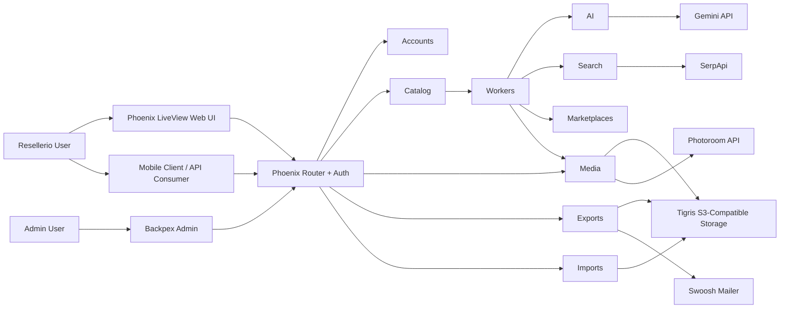
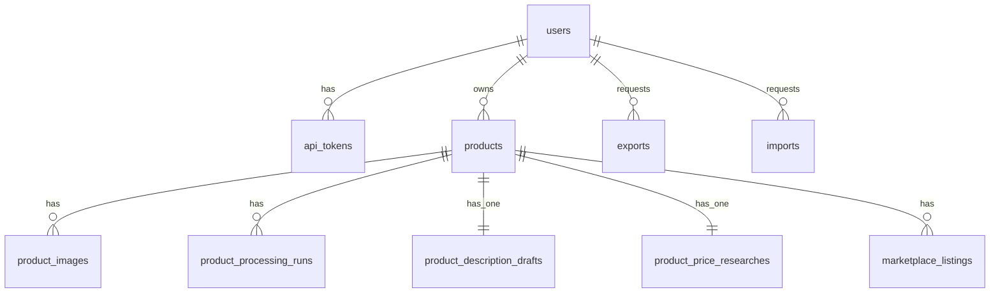
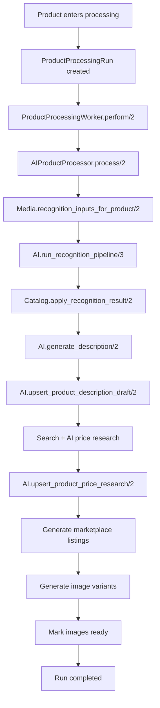

# Resellerio Architecture

## 1. Purpose

Resellerio is a Phoenix 1.8 application that powers:

- a mobile-first reseller product workflow
- a LiveView web workspace for the same core product operations
- an admin surface built with Backpex

The system is API-first, but the web workspace is now a first-class operational surface, not just a demo shell.

Core business goal:

1. create a `Product` from one or more photos
2. upload originals to Tigris
3. run AI recognition and enrichment
4. generate marketplace-ready listing drafts
5. optionally create processed image variants
6. support export/import of reseller archives

## 2. System Overview

### Main entry surfaces

- Public LiveView marketing page at `/`
- Browser auth at `/sign-up`, `/sign-in`, `DELETE /sign-out`
- Authenticated Resellerio workspace at `/app`, `/app/products`, `/app/listings`, `/app/exports`, `/app/settings`
- Admin interface at `/admin/...`
- Versioned JSON API at `/api/v1/...`

### High-level architecture



## 3. Runtime Topology

### OTP application tree

`Reseller.Application` starts:

- `ResellerWeb.Telemetry`
- `Reseller.Repo`
- `DNSCluster`
- `Phoenix.PubSub` as `Reseller.PubSub`
- `Task.Supervisor` as `Reseller.Workers.TaskSupervisor`
- `ResellerWeb.Endpoint`

Important note:

- background work currently runs via `Task.Supervisor`
- jobs are asynchronous, but not durable across process/node crashes
- the code is structured so a future durable queue can replace the current enqueue strategy with limited domain churn

### Request layers

- Browser HTML/LiveView requests go through the `:browser` pipeline
- JSON requests go through the `:api` pipeline
- Bearer-protected JSON requests add `ResellerWeb.Plugs.APIAuth`
- Browser admin routes add `ResellerWeb.BrowserAuth, :ensure_admin`

## 4. Bounded Contexts

### `Reseller.Accounts`

Responsibilities:

- user registration
- password verification
- browser session support
- API bearer token issuing and validation
- admin grants

Primary modules:

- `Reseller.Accounts`
- `Reseller.Accounts.User`
- `Reseller.Accounts.ApiToken`
- `Reseller.Accounts.Password`

### `Reseller.Catalog`

Responsibilities:

- product creation
- editable product fields, tags, and seller-managed status changes
- explicit lifecycle transitions
- ownership-scoped access
- preload orchestration for the product aggregate

Primary modules:

- `Reseller.Catalog`
- `Reseller.Catalog.Product`

### `Reseller.Media`

Responsibilities:

- upload intent creation
- image placeholder creation
- upload finalization
- public URL generation
- processed variant generation
- storage abstraction

Primary modules:

- `Reseller.Media`
- `Reseller.Media.ProductImage`
- `Reseller.Media.Storage`
- `Reseller.Media.Storage.Tigris`
- `Reseller.Media.Processor`
- `Reseller.Media.Processors.Photoroom`

### `Reseller.AI`

Responsibilities:

- image recognition orchestration
- normalization of AI output
- description generation
- price research generation
- provider abstraction

Primary modules:

- `Reseller.AI`
- `Reseller.AI.Provider`
- `Reseller.AI.RecognitionPipeline`
- `Reseller.AI.ImageSelection`
- `Reseller.AI.Normalizer`
- `Reseller.AI.ProductDescriptionDraft`
- `Reseller.AI.ProductPriceResearch`
- `Reseller.AI.Providers.Gemini`

### `Reseller.Search`

Responsibilities:

- visual match lookup
- shopping/comparable enrichment
- provider abstraction for search sources

Primary modules:

- `Reseller.Search`
- `Reseller.Search.Provider`
- `Reseller.Search.Providers.SerpApi`

### `Reseller.Marketplaces`

Responsibilities:

- per-marketplace generated listing persistence
- supported marketplace set

Primary modules:

- `Reseller.Marketplaces`
- `Reseller.Marketplaces.MarketplaceListing`

### `Reseller.Workers`

Responsibilities:

- product processing run records
- enqueueing and executing asynchronous product work
- processor abstraction

Primary modules:

- `Reseller.Workers`
- `Reseller.Workers.ProductProcessingRun`
- `Reseller.Workers.ProductProcessingWorker`
- `Reseller.Workers.ProductProcessor`
- `Reseller.Workers.AIProductProcessor`

### `Reseller.Exports`

Responsibilities:

- export run lifecycle
- ZIP assembly
- upload of export artifacts
- notification dispatch

Primary modules:

- `Reseller.Exports`
- `Reseller.Exports.Export`
- `Reseller.Exports.ExportWorker`
- `Reseller.Exports.ZipBuilder`
- `Reseller.Exports.Notifier`
- `Reseller.Exports.Notifiers.Email`

### `Reseller.Imports`

Responsibilities:

- archive intake
- upload of source ZIP
- ZIP parsing
- archive recreation into domain records
- per-import bookkeeping

Primary modules:

- `Reseller.Imports`
- `Reseller.Imports.Import`
- `Reseller.Imports.ImportRequest`
- `Reseller.Imports.ImportWorker`
- `Reseller.Imports.ZipParser`
- `Reseller.Imports.ArchiveImporter`

## 5. Interface Architecture

### Browser / LiveView

Main LiveViews:

- `ResellerWeb.HomeLive`
- `ResellerWeb.Auth.SignUpLive`
- `ResellerWeb.Auth.SignInLive`
- `ResellerWeb.WorkspaceLive`

The workspace LiveView currently supports:

- dashboard summaries
- product creation with browser uploads
- product filtering and selection
- product editing
- product lifecycle actions
- marketplace listing review
- export requests
- ZIP import uploads

### JSON API

Current authenticated API surface:

- `GET /api/v1/me`
- `GET /api/v1/products`
- `POST /api/v1/products`
- `GET /api/v1/products/:id`
- `PATCH /api/v1/products/:id`
- `DELETE /api/v1/products/:id`
- `POST /api/v1/products/:id/finalize_uploads`
- `POST /api/v1/products/:id/mark_sold`
- `POST /api/v1/products/:id/archive`
- `POST /api/v1/products/:id/unarchive`
- `POST /api/v1/exports`
- `GET /api/v1/exports/:id`
- `POST /api/v1/imports`
- `GET /api/v1/imports/:id`

### Admin

Backpex resources:

- `Users`
- `API Tokens`

The admin surface is intentionally separated from reseller-facing operations.

## 6. Database Architecture

## 6.1 Entity relationship summary



## 6.2 Tables and schemas

### `users`

Schema module: `Reseller.Accounts.User`

Purpose:

- reseller account
- browser-session principal
- API token owner
- admin flag carrier

Key fields:

| Field | Type | Notes |
| --- | --- | --- |
| `email` | `string` | unique, normalized to lowercase |
| `hashed_password` | `string` | required |
| `confirmed_at` | `utc_datetime` | currently optional |
| `is_admin` | `boolean` | default `false` |
| `inserted_at` / `updated_at` | `utc_datetime` | standard timestamps |

Constraints:

- unique index on `email`

### `api_tokens`

Schema module: `Reseller.Accounts.ApiToken`

Purpose:

- bearer-token auth for API clients

Key fields:

| Field | Type | Notes |
| --- | --- | --- |
| `user_id` | FK -> `users` | required |
| `token_hash` | `binary` | unique SHA-256 hash of the raw token |
| `context` | `string` | currently defaults to `mobile` |
| `device_name` | `string` | optional |
| `expires_at` | `utc_datetime` | required |
| `last_used_at` | `utc_datetime` | optional |
| `inserted_at` | `utc_datetime` | no `updated_at` |

Constraints:

- index on `user_id`
- unique index on `token_hash`

### `products`

Schema module: `Reseller.Catalog.Product`

Purpose:

- primary inventory record
- aggregate root for media, AI output, listings, and processing runs

Key fields:

| Field | Type | Notes |
| --- | --- | --- |
| `user_id` | FK -> `users` | required |
| `status` | `string` | `draft`, `uploading`, `processing`, `review`, `ready`, `sold`, `archived` |
| `source` | `string` | `manual`, `mobile`, `import`, `ai` |
| `title` | `string` | optional but preferred |
| `brand` / `category` / `condition` / `color` / `size` / `material` | `string` | editable product metadata |
| `price` / `cost` | `decimal(12,2)` | user-entered commercial values |
| `sku` | `string` | unique per user when present |
| `tags` | `string[]` | seller-defined labels for search/filtering/grouping |
| `notes` | `text` | reseller notes |
| `ai_summary` | `text` | AI-generated short summary |
| `ai_confidence` | `float` | normalized recognition confidence |
| `sold_at` | `utc_datetime` | set when product is marked sold |
| `archived_at` | `utc_datetime` | set when product is archived |
| `inserted_at` / `updated_at` | `utc_datetime` | standard timestamps |

Constraints:

- index on `user_id`
- compound index on `user_id, status`
- unique partial index on `user_id, sku` where `sku IS NOT NULL`

Manual status rules:

- sellers may set `draft`, `review`, `ready`, `sold`, and `archived`
- system-only statuses `uploading` and `processing` remain pipeline-controlled
- moving to `sold` sets `sold_at`
- moving to `archived` sets `archived_at`
- moving back to `draft`, `review`, or `ready` clears both timestamps

### `product_images`

Schema module: `Reseller.Media.ProductImage`

Purpose:

- original uploads
- finalized uploads
- processed variants

Key fields:

| Field | Type | Notes |
| --- | --- | --- |
| `product_id` | FK -> `products` | required |
| `kind` | `string` | `original`, `background_removed`, `white_background`, etc. |
| `position` | `integer` | display/order position |
| `storage_key` | `string` | object path in Tigris |
| `content_type` | `string` | must be image content |
| `width` / `height` | `integer` | optional image dimensions |
| `byte_size` | `integer` | optional at create, populated on finalize/upload |
| `checksum` | `string` | optional checksum of uploaded object |
| `background_style` | `string` | processed variant style metadata |
| `processing_status` | `string` | `pending_upload`, `uploaded`, `processing`, `ready`, `failed` |
| `original_filename` | `string` | client or archive filename |
| `inserted_at` / `updated_at` | `utc_datetime` | standard timestamps |

Constraints:

- index on `product_id`
- unique index on `storage_key`
- unique index on `product_id, kind, position`

### `product_processing_runs`

Schema module: `Reseller.Workers.ProductProcessingRun`

Purpose:

- asynchronous job bookkeeping for product processing

Key fields:

| Field | Type | Notes |
| --- | --- | --- |
| `product_id` | FK -> `products` | required |
| `status` | `string` | `queued`, `running`, `completed`, `failed` |
| `step` | `string` | current or terminal stage name |
| `started_at` / `finished_at` | `utc_datetime` | run timing |
| `error_code` | `string` | normalized error code |
| `error_message` | `text` | human-readable failure detail |
| `payload` | `map` | machine-readable run details |
| `inserted_at` / `updated_at` | `utc_datetime` | standard timestamps |

Indexes:

- `product_id`
- `product_id, inserted_at`
- `status`

### `product_description_drafts`

Schema module: `Reseller.AI.ProductDescriptionDraft`

Purpose:

- base AI-authored copy kept separate from editable product fields

Key fields:

| Field | Type | Notes |
| --- | --- | --- |
| `product_id` | FK -> `products` | unique, required |
| `status` | `string` | `generated`, `review`, `failed` |
| `provider` | `string` | e.g. Gemini |
| `model` | `string` | model identifier |
| `suggested_title` | `string` | generated title |
| `short_description` | `string` | required |
| `long_description` | `text` | optional |
| `key_features` | `string[]` | structured bullets |
| `seo_keywords` | `string[]` | generated keywords |
| `missing_details_warning` | `string` | caution text |
| `raw_payload` | `map` | provider payload snapshot |
| `inserted_at` / `updated_at` | `utc_datetime` | standard timestamps |

Constraint:

- unique index on `product_id`

### `product_price_researches`

Schema module: `Reseller.AI.ProductPriceResearch`

Purpose:

- generated pricing guidance and evidence, separate from `products.price`

Key fields:

| Field | Type | Notes |
| --- | --- | --- |
| `product_id` | FK -> `products` | unique, required |
| `status` | `string` | `generated`, `review`, `failed` |
| `provider` | `string` | AI provider |
| `model` | `string` | model identifier |
| `currency` | `string` | defaults to `USD` |
| `suggested_min_price` / `suggested_target_price` / `suggested_max_price` / `suggested_median_price` | `decimal(12,2)` | advisory prices |
| `pricing_confidence` | `float` | 0..1 |
| `rationale_summary` | `text` | human-readable explanation |
| `market_signals` | `string[]` | extracted pricing factors |
| `comparable_results` | `map` | normalized match data |
| `raw_payload` | `map` | provider payload snapshot |
| `inserted_at` / `updated_at` | `utc_datetime` | standard timestamps |

Constraint:

- unique index on `product_id`

### `marketplace_listings`

Schema module: `Reseller.Marketplaces.MarketplaceListing`

Purpose:

- marketplace-specific generated listing variants

Key fields:

| Field | Type | Notes |
| --- | --- | --- |
| `product_id` | FK -> `products` | required |
| `marketplace` | `string` | `ebay`, `depop`, `poshmark` |
| `status` | `string` | `generated`, `review`, `failed` |
| `generated_title` | `string` | required |
| `generated_description` | `text` | required |
| `generated_tags` | `string[]` | tags/keywords |
| `generated_price_suggestion` | `decimal(12,2)` | optional |
| `generation_version` | `string` | model or generation version |
| `compliance_warnings` | `string[]` | policy or formatting concerns |
| `raw_payload` | `map` | provider snapshot |
| `last_generated_at` | `utc_datetime` | recency tracking |
| `inserted_at` / `updated_at` | `utc_datetime` | standard timestamps |

Constraint:

- unique index on `product_id, marketplace`

### `exports`

Schema module: `Reseller.Exports.Export`

Purpose:

- ZIP export bookkeeping

Key fields:

| Field | Type | Notes |
| --- | --- | --- |
| `user_id` | FK -> `users` | required |
| `status` | `string` | `queued`, `running`, `completed`, `failed` |
| `storage_key` | `string` | ZIP object key in Tigris |
| `expires_at` | `utc_datetime` | artifact TTL boundary |
| `requested_at` | `utc_datetime` | required |
| `completed_at` | `utc_datetime` | terminal timestamp |
| `error_message` | `string` | failure detail |
| `inserted_at` / `updated_at` | `utc_datetime` | standard timestamps |

Index:

- `user_id`

### `imports`

Schema module: `Reseller.Imports.Import`

Purpose:

- ZIP import bookkeeping

Key fields:

| Field | Type | Notes |
| --- | --- | --- |
| `user_id` | FK -> `users` | required |
| `status` | `string` | `queued`, `running`, `completed`, `failed` |
| `source_filename` | `string` | uploaded ZIP filename |
| `source_storage_key` | `string` | stored source archive key |
| `requested_at` / `started_at` / `finished_at` | `utc_datetime` | timing |
| `total_products` / `imported_products` / `failed_products` | `integer` | counters |
| `error_message` | `string` | failure summary |
| `failure_details` | `map` | per-product failure items |
| `payload` | `map` | extra import metadata |
| `inserted_at` / `updated_at` | `utc_datetime` | standard timestamps |

Index:

- `user_id`

## 7. State Machines

### Product lifecycle

```text
draft -> uploading -> processing -> ready
draft -> uploading -> processing -> review
ready -> sold
ready -> archived
sold -> archived
archived -> ready
archived -> sold
```

Notes:

- `review` means AI succeeded but user review is needed
- worker failure also drives products into `review`
- product field edits do not imply state changes

### Product image processing lifecycle

```text
pending_upload -> uploaded -> processing -> ready
pending_upload -> uploaded -> processing -> failed
```

### Export lifecycle

```text
queued -> running -> completed
queued -> running -> failed
```

### Import lifecycle

```text
queued -> running -> completed
queued -> running -> failed
```

## 8. Core Process Flows

## 8.1 Browser sign-up / sign-in

1. User opens `/sign-up` or `/sign-in`
2. LiveView renders form UI
3. Form posts to `RegistrationController` or `SessionController`
4. `Reseller.Accounts` validates credentials
5. Browser session stores `user_id`
6. Authenticated routes use `ResellerWeb.LiveUserAuth`

## 8.2 Mobile/API auth

1. Client calls `/api/v1/auth/register` or `/api/v1/auth/login`
2. `AuthController` uses `Reseller.Accounts`
3. `Reseller.Accounts.issue_api_token/2` stores hashed token in `api_tokens`
4. Client sends `Authorization: Bearer ...`
5. `ResellerWeb.Plugs.APIAuth` resolves current user

## 8.3 Product creation and upload finalization

### API/mobile path

1. Client calls `POST /api/v1/products` with product attrs and upload specs
2. `Catalog.create_product_for_user/4` creates `products` row
3. `Media.prepare_product_uploads/4` creates `product_images` placeholders
4. `Media.Storage.sign_upload/2` returns presigned Tigris PUT instructions
5. Client uploads binaries directly to Tigris
6. Client calls `POST /api/v1/products/:id/finalize_uploads`
7. `Catalog.finalize_product_uploads_for_user/3` marks images `uploaded`
8. If all originals are finalized, product moves to `processing`
9. `Reseller.Workers.start_product_processing/2` creates `product_processing_runs`

### Web path

1. User opens `/app/products`
2. `WorkspaceLive` collects product fields and file inputs
3. `Catalog.create_product_for_user/4` creates product and image records
4. LiveView reads temporary upload files and calls `Media.Storage.upload_object/3`
5. LiveView finalizes the uploaded image set through `Catalog.finalize_product_uploads_for_user/3`
6. Product processing starts the same way as the API/mobile path

## 8.4 AI processing pipeline



Detailed steps:

1. `ProductProcessingWorker` marks run `running` and switches uploaded images to `processing`
2. `AIProductProcessor` collects public image URLs from `Reseller.Media`
3. `Reseller.AI.RecognitionPipeline` runs Gemini extraction
4. If confidence is weak, pipeline enriches with SerpApi Google Lens / shopping
5. Reconciled result is normalized and persisted onto `products`
6. Description draft is generated and upserted
7. Price research is generated using AI plus normalized search evidence
8. Marketplace listings are generated per supported marketplace
9. Photoroom-backed image variants are attempted
10. Original images in processing are marked `ready`
11. Run is marked `completed` with detailed payload

Failure path:

1. worker marks in-flight images `failed`
2. product is moved to `review`
3. run is marked `failed` with code, message, and payload

## 8.5 ZIP export flow

1. User requests export via API or LiveView
2. `Reseller.Exports.request_export_for_user/2` creates `exports` row in `queued`
3. `ExportWorker.perform/2` marks export `running`
4. `ZipBuilder.build_user_export/2` loads products and images
5. Image binaries are fetched using public URLs
6. ZIP is assembled with:
   - `index.json`
   - `images/...`
7. ZIP is uploaded through `Reseller.Media.Storage`
8. Export is marked `completed`
9. notifier sends export-ready email

## 8.6 ZIP import flow

1. User uploads ZIP via API or LiveView
2. `Reseller.Imports.request_import_for_user/3` validates base64/archive metadata
3. Source ZIP is uploaded to storage
4. `ImportWorker.perform/2` marks import `running`
5. `ZipParser.parse_archive/1` reads `index.json` and image entries
6. `ArchiveImporter.import_user_archive/3` recreates:
   - `products`
   - `product_images`
   - `product_description_drafts`
   - `product_price_researches`
   - `marketplace_listings`
7. Import summary is stored on `imports`
8. Import is marked `completed` or `failed`

Important behavior:

- import is best-effort per product
- one bad product does not force the whole archive to roll back
- per-product failure details are stored in `imports.failure_details`

## 9. External Integrations

### Gemini

Used for:

- image recognition
- reconciliation
- description generation
- price research reasoning
- marketplace listing generation

Adapter:

- `Reseller.AI.Providers.Gemini`

### SerpApi

Used for:

- Google Lens visual matches
- Google Shopping / comparable enrichment

Adapter:

- `Reseller.Search.Providers.SerpApi`

### Tigris

Used for:

- original image uploads
- processed image uploads
- export archive uploads
- import source archive uploads
- public URL resolution

Adapter:

- `Reseller.Media.Storage.Tigris`

### Photoroom

Used for:

- background removal
- white-background variant generation

Adapter:

- `Reseller.Media.Processors.Photoroom`

### Swoosh

Used for:

- export-ready email notifications

## 10. Configuration Architecture

### Compile-time/default config

`config/config.exs` defines defaults for:

- Gemini models and base URL
- SerpApi base URL
- media provider modules
- worker mode and processor module
- marketplace list
- export builder/notifier
- Backpex

### Runtime config

`config/runtime.exs` reads:

- `GEMINI_API_KEY`
- `SERPAPI_API_KEY`
- `TIGRIS_ACCESS_KEY_ID`
- `TIGRIS_SECRET_ACCESS_KEY`
- `TIGRIS_BUCKET_URL`
- `PHOTOROOM_API_KEY`
- production Phoenix and database environment variables

## 11. Testing Architecture

Test strategy today:

- context unit tests for domain logic
- controller/API tests for JSON surface
- LiveView tests for browser workspace behavior
- admin tests for Backpex access
- penetration-style regression tests for auth boundaries
- fake providers under `test/support/fakes` for AI, search, media, and notifier integrations

Important test design choice:

- external integrations are hidden behind behaviours or facades so tests do not need live network access

## 12. Known Architectural Constraints

- background jobs are not durable yet
- passkey architecture is not implemented yet
- storage lifecycle management is stronger for uploads than for retention/cleanup
- the workspace currently centralizes many web behaviors in a single `WorkspaceLive`; this is functional today, but future extraction into dedicated LiveViews is likely

## 13. Near-Term Evolution

Likely next architecture changes:

- passkey ceremonies and persistence
- richer AI review/regeneration controls
- possibly a durable job system
- deeper admin observability over AI, exports, and imports
- breaking `WorkspaceLive` into dedicated LiveViews as complexity grows
