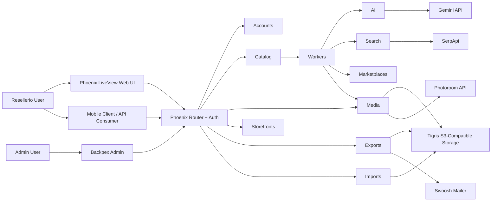
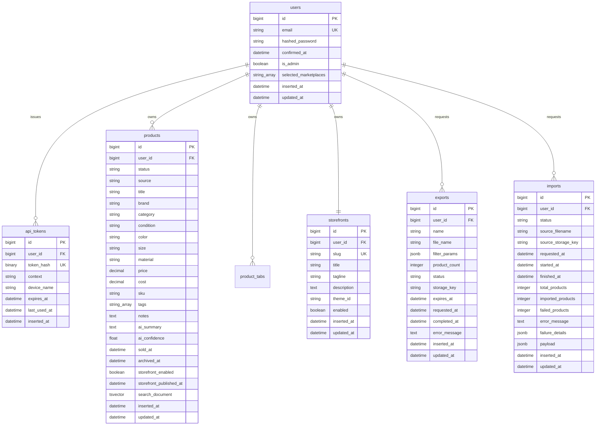
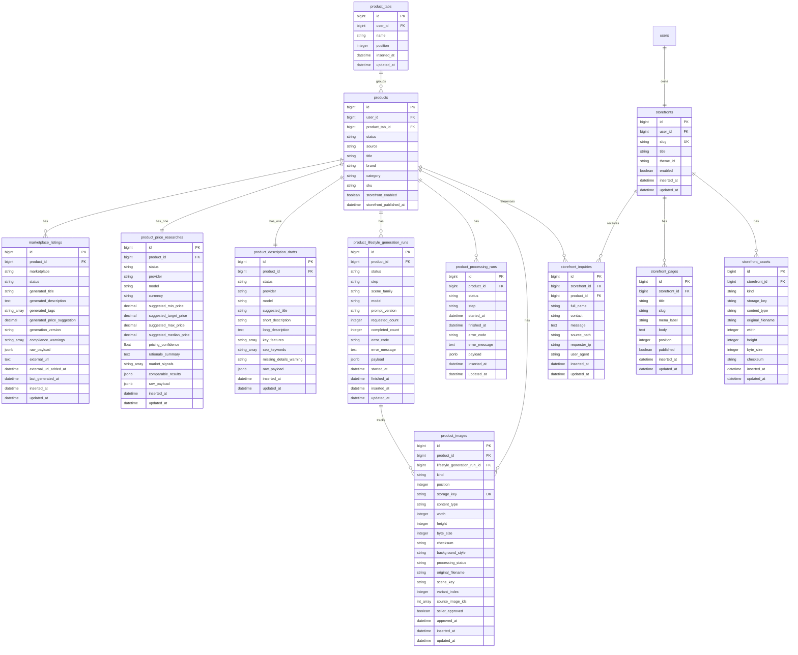
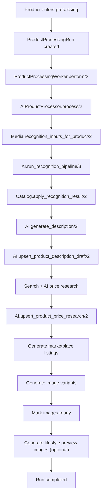

# Resellerio Architecture

## 1. Purpose

Resellerio is a Phoenix 1.8 application that powers:

- a mobile-first reseller product workflow
- a LiveView web workspace for the same core product operations
- an admin surface built with Backpex

The system is API-first, but the web workspace is now a first-class operational surface, not just a demo shell.

Core business goal:

1. create a `Product` from one or more photos
2. upload originals to Tigris
3. run AI recognition and enrichment
4. generate marketplace-ready listing drafts
5. optionally create processed image variants
6. optionally generate AI lifestyle preview images
7. support export/import of reseller archives

## 2. System Overview

### Main entry surfaces

- Public LiveView marketing page at `/`
- Public storefront browser routes at `/store/:slug`, `/store/:slug/products/:product_ref`, and `/store/:slug/pages/:page_slug`
- Browser auth at `/sign-up`, `/sign-in`, `DELETE /sign-out`
- Authenticated Resellerio workspace at `/app`, `/app/products`, `/app/exports`, `/app/inquiries`, `/app/settings`
- Admin interface at `/admin/...`
- Versioned JSON API at `/api/v1/...`

### High-level architecture



## 3. Runtime Topology

### OTP application tree

`Reseller.Application` starts:

- `ResellerWeb.Telemetry`
- `Reseller.Repo`
- `DNSCluster`
- `Phoenix.PubSub` as `Reseller.PubSub`
- `Task.Supervisor` as `Reseller.Workers.TaskSupervisor`
- `ResellerWeb.Endpoint`

Important note:

- background work currently runs via `Task.Supervisor`
- jobs are asynchronous, but not durable across process/node crashes
- the code is structured so a future durable queue can replace the current enqueue strategy with limited domain churn

### Request layers

- Browser HTML/LiveView requests go through the `:browser` pipeline
- Public storefront browser routes use controller-rendered HTML so disabled storefronts and unpublished content can return real `404` responses
- JSON requests go through the `:api` pipeline
- Bearer-protected JSON requests add `ResellerWeb.Plugs.APIAuth`
- Browser admin routes add `ResellerWeb.BrowserAuth, :ensure_admin`

## 4. Bounded Contexts

### `Reseller.Accounts`

Responsibilities:

- user registration
- password verification
- browser session support
- API bearer token issuing and validation
- per-user marketplace-generation defaults
- admin grants

Primary modules:

- `Reseller.Accounts`
- `Reseller.Accounts.User`
- `Reseller.Accounts.ApiToken`
- `Reseller.Accounts.Password`

### `Reseller.Catalog`

Responsibilities:

- product creation
- seller-defined product tabs for workspace organization
- editable product fields, tags, and seller-managed status changes
- explicit lifecycle transitions
- ownership-scoped access
- preload orchestration for the product aggregate

Primary modules:

- `Reseller.Catalog`
- `Reseller.Catalog.Product`
- `Reseller.Catalog.ProductTab`

### `Reseller.Media`

Responsibilities:

- upload intent creation
- image placeholder creation
- upload finalization
- public URL generation
- processed variant generation
- storage abstraction

Primary modules:

- `Reseller.Media`
- `Reseller.Media.ProductImage`
- `Reseller.Media.Storage`
- `Reseller.Media.Storage.Tigris`
- `Reseller.Media.Processor`
- `Reseller.Media.Processors.Photoroom`

### `Reseller.AI`

Responsibilities:

- image recognition orchestration
- normalization of AI output
- description generation
- price research generation
- lifestyle-image generation run tracking
- provider abstraction

Primary modules:

- `Reseller.AI`
- `Reseller.AI.GeneratedImage`
- `Reseller.AI.LifestylePromptBuilder`
- `Reseller.AI.Provider`
- `Reseller.AI.RecognitionPipeline`
- `Reseller.AI.ImageSelection`
- `Reseller.AI.Normalizer`
- `Reseller.AI.ProductDescriptionDraft`
- `Reseller.AI.ProductLifestyleGenerationRun`
- `Reseller.AI.ProductPriceResearch`
- `Reseller.AI.ScenePlanner`
- `Reseller.AI.Providers.Gemini`

### `Reseller.Search`

Responsibilities:

- visual match lookup
- shopping/comparable enrichment
- provider abstraction for search sources

Primary modules:

- `Reseller.Search`
- `Reseller.Search.Provider`
- `Reseller.Search.Providers.SerpApi`

### `Reseller.Marketplaces`

Responsibilities:

- per-marketplace generated listing persistence
- seller-managed external listing URL persistence
- supported marketplace catalog
- marketplace label normalization for UI and API consumers

Reference docs:

- `docs/MARKETS.md`

Primary modules:

- `Reseller.Marketplaces`
- `Reseller.Marketplaces.MarketplaceListing`

### `Reseller.Storefronts`

Responsibilities:

- seller storefront identity and branding configuration
- curated storefront theme preset catalog
- custom storefront page CRUD
- public storefront lookup by slug
- public catalog, product, and page queries with search and visibility filtering
- storefront inquiry persistence with per-IP and per-storefront rate limiting
- inquiry notification dispatch
- owner-scoped inquiry listing with search, pagination, and deletion

Primary modules:

- `Reseller.Storefronts`
- `Reseller.Storefronts.Storefront`
- `Reseller.Storefronts.StorefrontAsset`
- `Reseller.Storefronts.StorefrontPage`
- `Reseller.Storefronts.StorefrontInquiry`
- `Reseller.Storefronts.ThemePresets`
- `Reseller.Storefronts.Notifier`
- `Reseller.Storefronts.Notifiers.Email`

### `Reseller.Workers`

Responsibilities:

- product processing run records
- enqueueing and executing asynchronous product work
- processor abstraction

Primary modules:

- `Reseller.Workers`
- `Reseller.Workers.ProductProcessingRun`
- `Reseller.Workers.ProductProcessingWorker`
- `Reseller.Workers.ProductProcessor`
- `Reseller.Workers.AIProductProcessor`
- `Reseller.Workers.LifestyleImageGenerator`

### `Reseller.Exports`

Responsibilities:

- export run lifecycle
- ZIP assembly
- upload of export artifacts
- notification dispatch

Primary modules:

- `Reseller.Exports`
- `Reseller.Exports.Export`
- `Reseller.Exports.ExportWorker`
- `Reseller.Exports.ZipBuilder`
- `Reseller.Exports.Notifier`
- `Reseller.Exports.Notifiers.Email`

### `Reseller.Imports`

Responsibilities:

- archive intake
- upload of source ZIP
- ZIP parsing
- archive recreation into domain records
- per-import bookkeeping

Primary modules:

- `Reseller.Imports`
- `Reseller.Imports.Import`
- `Reseller.Imports.ImportRequest`
- `Reseller.Imports.ImportWorker`
- `Reseller.Imports.ZipParser`
- `Reseller.Imports.ArchiveImporter`

## 5. Interface Architecture

### Browser / LiveView

Main LiveViews:

- `ResellerWeb.HomeLive`
- `ResellerWeb.Auth.SignUpLive`
- `ResellerWeb.Auth.SignInLive`
- `ResellerWeb.WorkspaceLive`
- `ResellerWeb.ProductsLive.Index`
- `ResellerWeb.ProductsLive.New`
- `ResellerWeb.ProductsLive.Show`
- `ResellerWeb.InquiriesLive`

The workspace LiveView currently supports:

- dashboard summaries
- product creation with browser uploads
- product filtering and selection
- product editing
- product lifecycle actions
- marketplace listing review
- marketplace target settings
- export requests
- ZIP import uploads
- storefront configuration, branding asset uploads, and public page CRUD

`ResellerWeb.InquiriesLive` handles:

- paginated listing of all storefront inquiries for the authenticated seller
- search across name, contact, and message fields
- per-row deletion with ownership enforcement

### JSON API

Current authenticated API surface:

- `GET /api/v1/me`
- `PATCH /api/v1/me`
- `GET /api/v1/products`
- `POST /api/v1/products`
- `GET /api/v1/products/:id`
- `PATCH /api/v1/products/:id`
- `DELETE /api/v1/products/:id`
- `POST /api/v1/products/:id/finalize_uploads`
- `POST /api/v1/products/:id/mark_sold`
- `POST /api/v1/products/:id/archive`
- `POST /api/v1/products/:id/unarchive`
- `POST /api/v1/exports`
- `GET /api/v1/exports/:id`
- `POST /api/v1/imports`
- `GET /api/v1/imports/:id`

### Admin

Backpex resources:

- `Users`
- `API Tokens`

The admin surface is intentionally separated from reseller-facing operations.

## 6. Database Architecture

## 6.1 Mermaid ER diagrams

The diagrams below reflect the current migrated PostgreSQL schema. Embedded Ecto request validators such as `upload_batches`, `finalize_upload_batches`, and `import_requests` are not database tables and are intentionally excluded.

### Auth, inventory, and transfer tables



### Media, AI, and marketplace tables



## 6.2 Table inventory

| Table | Ecto module | Purpose |
| --- | --- | --- |
| `users` | `Reseller.Accounts.User` | reseller accounts, browser auth principal, admin flag, marketplace defaults |
| `api_tokens` | `Reseller.Accounts.ApiToken` | mobile/API bearer tokens with expiry and `last_used_at` tracking |
| `products` | `Reseller.Catalog.Product` | aggregate root for inventory, AI data, media, exports, and lifecycle |
| `storefronts` | `Reseller.Storefronts.Storefront` | one seller-owned public storefront configuration and slug identity |
| `storefront_assets` | `Reseller.Storefronts.StorefrontAsset` | logo and header branding assets for a storefront |
| `storefront_pages` | `Reseller.Storefronts.StorefrontPage` | seller-authored public informational pages |
| `storefront_inquiries` | `Reseller.Storefronts.StorefrontInquiry` | public request capture linked to a storefront and optional product |
| `product_tabs` | `Reseller.Catalog.ProductTab` | seller-defined workspace buckets used to group and filter products |
| `product_images` | `Reseller.Media.ProductImage` | original uploads, processed variants, and lifestyle-generated previews |
| `product_processing_runs` | `Reseller.Workers.ProductProcessingRun` | async AI pipeline bookkeeping for products |
| `product_lifestyle_generation_runs` | `Reseller.AI.ProductLifestyleGenerationRun` | dedicated lifestyle-image generation bookkeeping |
| `product_description_drafts` | `Reseller.AI.ProductDescriptionDraft` | AI-authored base titles and descriptions |
| `product_price_researches` | `Reseller.AI.ProductPriceResearch` | AI-authored pricing guidance and evidence |
| `marketplace_listings` | `Reseller.Marketplaces.MarketplaceListing` | marketplace-specific generated copy for one product |
| `exports` | `Reseller.Exports.Export` | ZIP export request history, artifact metadata, stalled/failure state |
| `imports` | `Reseller.Imports.Import` | ZIP import request history, counters, and failure details |

## 6.3 Important constraints and indexes

- `users.email` is unique.
- `api_tokens.token_hash` is unique; `api_tokens.user_id` is indexed.
- `products` has indexes on `user_id`, `user_id + status`, `user_id + product_tab_id`, `user_id + storefront_enabled + status`, `product_tab_id`, and a partial unique index on `user_id + sku` when `sku IS NOT NULL`.
- `products.search_document` is a PostgreSQL `tsvector` maintained by the `products_search_document_update` trigger and indexed with `products_search_document_index`.
- `storefronts` is unique on both `user_id` and `slug`.
- `storefront_assets` is unique on `storefront_id + kind`.
- `storefront_pages` is unique on `storefront_id + slug` and indexed on `storefront_id + position`.
- `storefront_inquiries` is indexed on `storefront_id + inserted_at` and `product_id + inserted_at`.
- `product_tabs` is indexed on `user_id` and `user_id + position`, and is unique on `user_id + name`.
- `product_images.storage_key` is unique.
- `product_images` is unique on `product_id + kind + position`.
- `product_images` also has a partial unique index on `lifestyle_generation_run_id + scene_key + variant_index`.
- `product_description_drafts.product_id` and `product_price_researches.product_id` are one-to-one unique foreign keys.
- `marketplace_listings` is unique on `product_id + marketplace`.
- `exports.user_id`, `imports.user_id`, `product_processing_runs.status`, and `product_lifestyle_generation_runs.status` are indexed for read/reporting paths.

## 7. State Machines

### Product lifecycle

```text
draft -> uploading -> processing -> ready
draft -> uploading -> processing -> review
ready -> sold
ready -> archived
sold -> archived
archived -> ready
archived -> sold
```

Notes:

- `review` means AI succeeded but user review is needed
- worker failure also drives products into `review`
- product field edits do not imply state changes

### Product image processing lifecycle

```text
pending_upload -> uploaded -> processing -> ready
pending_upload -> uploaded -> processing -> failed
```

### Export lifecycle

```text
queued -> running -> completed
queued -> running -> failed
queued -> stalled
queued -> running -> stalled
stalled -> completed
stalled -> failed
```

### Import lifecycle

```text
queued -> running -> completed
queued -> running -> failed
```

## 8. Core Process Flows

## 8.1 Browser sign-up / sign-in

1. User opens `/sign-up` or `/sign-in`
2. LiveView renders form UI
3. Form posts to `RegistrationController` or `SessionController`
4. `Reseller.Accounts` validates credentials
5. Browser session stores `user_id`
6. Authenticated routes use `ResellerWeb.LiveUserAuth`

## 8.2 Mobile/API auth

1. Client calls `/api/v1/auth/register` or `/api/v1/auth/login`
2. `AuthController` uses `Reseller.Accounts`
3. `Reseller.Accounts.issue_api_token/2` stores hashed token in `api_tokens`
4. Client sends `Authorization: Bearer ...`
5. `ResellerWeb.Plugs.APIAuth` resolves current user

## 8.3 Product creation and upload finalization

### API/mobile path

1. Client calls `POST /api/v1/products` with product attrs and upload specs
2. `Catalog.create_product_for_user/4` creates `products` row
3. `Media.prepare_product_uploads/4` creates `product_images` placeholders
4. `Media.Storage.sign_upload/2` returns presigned Tigris PUT instructions
5. Client uploads binaries directly to Tigris
6. Client calls `POST /api/v1/products/:id/finalize_uploads`
7. `Catalog.finalize_product_uploads_for_user/3` marks images `uploaded`
8. If all originals are finalized, product moves to `processing`
9. `Reseller.Workers.start_product_processing/2` creates `product_processing_runs`

### Web path

1. User opens `/app/products`
2. `ProductsLive.Index` can filter inventory by seller-defined `product_tabs`
3. `ProductsLive.New` collects the optional `product_tab_id` and file inputs
4. `Catalog.create_product_for_user/4` creates product and image records
5. LiveView reads temporary upload files and calls `Media.Storage.upload_object/3`
6. LiveView finalizes the uploaded image set through `Catalog.finalize_product_uploads_for_user/3`
7. Product processing starts the same way as the API/mobile path

## 8.4 AI processing pipeline



Detailed steps:

1. `ProductProcessingWorker` marks run `running` and switches uploaded images to `processing`
2. `AIProductProcessor` collects storage-backed image inputs from `Reseller.Media`
3. `Reseller.AI.RecognitionPipeline` runs Gemini extraction
4. If confidence is weak, pipeline enriches with SerpApi Google Lens / shopping
5. Reconciled result is normalized and persisted onto `products`
6. Description draft is generated and upserted
7. Price research is generated using AI plus normalized search evidence
8. Marketplace listings are generated per selected marketplace on the owning user
9. Photoroom-backed image variants are attempted
10. Original images in processing are marked `ready`
11. If `Reseller.AI.lifestyle_generation_enabled?/1` is enabled, category-aware Gemini lifestyle prompts run against up to three cleaned or original source images
12. Run is marked `completed` with detailed payload including any lifestyle-generation summary

Failure path:

1. worker marks in-flight images `failed`
2. product is moved to `review`
3. run is marked `failed` with code, message, and payload

Optional lifestyle-generation behavior:

- this step runs after the product is already usable
- partial or failed lifestyle generation does not roll back the product to an unusable state
- a dedicated `product_lifestyle_generation_runs` row captures scene-level success and failure details separately from the main processing run

## 8.5 ZIP export flow

1. User requests export from the Products page or API
2. `Reseller.Exports.request_export_for_user/2` creates `exports` row in `queued`
3. Requested export name, normalized filter params, and matching product count are stored on `exports`
4. `ExportWorker.perform/2` marks export `running`
5. `ZipBuilder.build_export/3` loads all products that match the saved filters, ignoring Products-page pagination
6. Image binaries are fetched using signed download URLs when available
7. ZIP is assembled with:
   - `Products.xls`
   - `manifest.json`
   - `images/<product_id>/...`
8. ZIP is uploaded through `Reseller.Media.Storage`
9. Export is marked `completed`
10. notifier sends export-ready email and the same finished archive appears on `/app/exports`

If a `queued` or `running` export sits unchanged past the stale timeout window, read surfaces reclassify it to `stalled` with a retry-oriented `error_message`.
Re-running a stalled export from the workspace creates a fresh export row using the stalled export's saved name and filters.

## 8.6 ZIP import flow

1. User uploads ZIP via API or LiveView
2. `Reseller.Imports.request_import_for_user/3` validates base64/archive metadata
3. Source ZIP is uploaded to storage
4. `ImportWorker.perform/2` marks import `running`
5. `ZipParser.parse_archive/1` reads `manifest.json` plus image entries and ignores `Products.xls`
6. `ArchiveImporter.import_user_archive/3` recreates:
   - `products`
   - `product_images`
   - `product_description_drafts`
   - `product_price_researches`
   - `marketplace_listings`
7. Import summary is stored on `imports`
8. Import is marked `completed` or `failed`

Important behavior:

- import is best-effort per product
- one bad product does not force the whole archive to roll back
- per-product failure details are stored in `imports.failure_details`

## 9. External Integrations

### Gemini

Used for:

- image recognition
- reconciliation
- description generation
- price research reasoning
- marketplace listing generation

Adapter:

- `Reseller.AI.Providers.Gemini`

### SerpApi

Used for:

- Google Lens visual matches
- Google Shopping / comparable enrichment

Adapter:

- `Reseller.Search.Providers.SerpApi`

### Tigris

Used for:

- original image uploads
- processed image uploads
- export archive uploads
- import source archive uploads
- public URL resolution

Adapter:

- `Reseller.Media.Storage.Tigris` using ExAws S3 against Tigris-compatible storage

### Photoroom

Used for:

- background removal

Adapter:

- `Reseller.Media.Processors.Photoroom`

### Swoosh

Used for:

- export-ready email notifications
- storefront inquiry email notifications to storefront owners

## 10. Configuration Architecture

### Compile-time/default config

`config/config.exs` defines defaults for:

- Gemini models and base URL
- SerpApi base URL
- media provider modules
- worker mode and processor module
- supported and default marketplace lists
- export builder/notifier
- Backpex

### Runtime config

`config/runtime.exs` reads:

- `GEMINI_API_KEY`
- `SERPAPI_API_KEY`
- `TIGRIS_ACCESS_KEY_ID`
- `TIGRIS_SECRET_ACCESS_KEY`
- `TIGRIS_BUCKET_URL`
- `PHOTOROOM_API_KEY`
- production Phoenix and database environment variables

## 11. Testing Architecture

Test strategy today:

- context unit tests for domain logic
- controller/API tests for JSON surface
- LiveView tests for browser workspace behavior
- admin tests for Backpex access
- penetration-style regression tests for auth boundaries
- fake providers under `test/support/fakes` for AI, search, media, and notifier integrations

Important test design choice:

- external integrations are hidden behind behaviours or facades so tests do not need live network access

## 12. Known Architectural Constraints

- background jobs are not durable yet
- passkey architecture is not implemented yet
- storage lifecycle management is stronger for uploads than for retention/cleanup
- `WorkspaceLive` still centralizes dashboard, export/import, and settings; further extraction into dedicated LiveViews is likely as complexity grows (`InquiriesLive` is already an example of this direction)

## 13. Near-Term Evolution

Likely next architecture changes:

- passkey ceremonies and persistence
- richer AI review/regeneration controls
- possibly a durable job system
- deeper admin observability over AI, exports, and imports
- breaking `WorkspaceLive` into dedicated LiveViews as complexity grows
