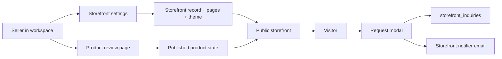

# ResellerIO Public Storefront Plan

## Progress Tracker

- [x] Step SF1: Add a dedicated `Reseller.Storefronts` context plus the schema and migration foundation for storefronts, assets, pages, inquiries, and product publication state.
- [x] Step SF2: Build `/app/settings` storefront customization with branding uploads, slug and copy settings, a 20-preset theme picker, and page CRUD.
- [x] Step SF3: Add product-level storefront publishing controls and marketplace external-link editing in the product review flow.
- [x] Step SF4: Build public storefront catalog, product, page, search, and sharing routes.
- [x] Step SF5: Add request capture, persistence, anti-spam guardrails, and reseller notifications.
- [x] Step SF6: Add API parity where needed, update related docs, and cover the new flows with regression tests.
- [ ] Step SF7: Add SEO and social card meta tags (canonical URL, Open Graph image, description) to public storefront pages.

## Latest Planning Status

- Completed: Step SF1 landed `Reseller.Storefronts`, the `storefronts` / `storefront_assets` / `storefront_pages` / `storefront_inquiries` tables, a 20-preset theme catalog, shared slug normalization, product-level storefront publication fields, and marketplace external listing URLs.
- Completed: Step SF2 now exposes storefront settings inside `/app/settings`, including storefront profile fields, preset theme selection, logo/header uploads, and modal-based public page CRUD with simple reordering.
- Completed: Step SF3 now exposes product-level storefront publishing controls and seller-managed external marketplace URLs inside the review screen at `/app/products/:id`.
- Completed: Step SF4 now exposes public catalog, product, and custom-page browser routes under `/store/:slug` via `StorefrontController`, including storefront-themed rendering, catalog search, shareable product URLs, and `404` handling for disabled or unpublished content. Note: implemented as a plain controller rather than LiveView routes.
- Completed: Step SF5 — inquiry POST at `/store/:slug/products/:product_ref/inquiries`, honeypot rejection, per-IP/per-storefront rate limiting, and email notification via `Reseller.Storefronts.Notifier`.
- Completed: Step SF6 adds regression tests for all new storefront flows (inquiry POST, honeypot rejection, rate limiting, request form rendering), fixes two pre-existing test regressions from the auto-upload and toggle-storefront changes, updates `ARCHITECTURE.md` with the new `Reseller.Storefronts.Notifier` modules and inquiry flow, and marks all SF steps complete in the plan.
- Remaining: Step SF7 — `root.html.heex` does not yet accept or render canonical URL, `og:description`, or `og:image` assigns. Public storefront pages currently have no SEO/social card meta tags.
- The repo already has the right primitives for a clean first implementation: public media URLs via `Reseller.Media`, owner-scoped full-text product search via `products.search_document`, marketplace rows keyed by `product_id + marketplace`, and an email notifier pattern in `Reseller.Exports.Notifier`.
- Recommended v1 shape: add a dedicated `Reseller.Storefronts` context, keep theme customization preset-only with 20 curated palettes, use plain-text custom pages first, and expose storefronts under `/store/:slug` so the new routes do not collide with `/app`, `/api`, `/admin`, `/sign-in`, or `/sign-up`.

## 1. Goal

Translate the requested feature into three concrete product flows:

- A seller can configure a public storefront from settings by uploading a logo and header image, selecting a theme preset, and creating menu pages.
- A seller can publish a product from the existing review screen after image uploads are finalized, then attach external marketplace URLs for the marketplaces where that item has actually been listed.
- A public visitor can browse and search the storefront, open shareable product URLs, view product information and images, and either click external marketplace buttons or submit a request when no external listing URL exists.

## 2. Current Repo Analysis

- `Reseller.Accounts.User` currently stores email, password data, admin flagging, and `selected_marketplaces`. There is no public slug, branding data, or storefront enable/disable state.
- `Reseller.Catalog.Product` is already the aggregate root for product lifecycle and should remain the owner of per-product storefront publication state.
- `Reseller.Marketplaces.MarketplaceListing` is already the correct place for per-marketplace seller-entered external listing URLs. Those URLs should not be stored on `users` or duplicated on `products`.
- `WorkspaceLive` already mixes dashboard, exports, imports, and settings concerns. Storefront settings can stay at `/app/settings`, but the implementation should be extracted into dedicated helpers, function components, or a separate settings LiveView rather than expanding one large module further.
- `ProductTab` should not be reused for public menu pages. Tabs organize internal workspace inventory; public pages are a separate concern with different fields, routing, and publishing rules.
- `ProductImage` should not be reused for storefront logo and header assets. Product images belong to the product aggregate and have product-processing semantics. Storefront branding assets need their own narrow model.
- `HomeLive` should remain the marketing homepage. A public seller storefront is a separate surface, not a replacement for `/`.

## 3. Recommended Bounded Context Shape

Add a new `Reseller.Storefronts` context.

Responsibilities:

- seller storefront identity and configuration
- theme preset catalog
- storefront logo and header asset lifecycle
- custom menu page CRUD
- public storefront queries
- public inquiry persistence and notification dispatch

Keep responsibilities split this way:

- `Reseller.Storefronts` owns storefront, pages, branding, and inquiries
- `Reseller.Catalog.Product` keeps the product-level publish toggle
- `Reseller.Marketplaces.MarketplaceListing` keeps marketplace-specific outbound URLs
- `Reseller.Media.Storage` remains the storage abstraction for uploads and public URLs

Recommended new modules:

- `Reseller.Storefronts`
- `Reseller.Storefronts.Storefront`
- `Reseller.Storefronts.StorefrontAsset`
- `Reseller.Storefronts.StorefrontPage`
- `Reseller.Storefronts.StorefrontInquiry`
- `Reseller.Storefronts.ThemePresets`
- `Reseller.Storefronts.Notifier`
- `Reseller.Storefronts.Notifiers.Email`

## 4. Route Plan

Seller-facing routes:

- Keep storefront configuration under `/app/settings`
- Keep per-product publishing controls inside `/app/products/:id`

Public route recommendation:

- `live "/store/:slug", ResellerWeb.StorefrontLive.Index, :index`
- `live "/store/:slug/products/:product_ref", ResellerWeb.StorefrontLive.Product, :show`
- `live "/store/:slug/pages/:page_slug", ResellerWeb.StorefrontLive.Page, :show`

Why `/store/:slug` instead of `/:slug`:

- it avoids collisions with existing top-level routes
- it avoids future reserved-path headaches
- it keeps marketing and seller storefront routing clearly separated

Recommended `product_ref` format:

- `#{product.id}-#{slugified_title}`

Implementation note:

- parse the leading numeric id for lookup and treat the slug tail as cosmetic in v1
- do not add a dedicated public product slug table in the first milestone
- extract a shared slug normalizer instead of duplicating the private `slugify/1` now living inside `Reseller.Exports`

Public visibility rules:

- disabled storefronts return `404`
- unpublished pages return `404`
- products not enabled for storefront or no longer saleable return `404`

## 5. Data Model Plan

### New tables

`storefronts`

- `user_id`
- `slug`
- `title`
- `tagline`
- `description`
- `theme_id`
- `enabled`
- timestamps

Recommended constraints and indexes:

- unique index on `user_id`
- unique index on `slug`
- validation that `theme_id` exists in `Reseller.Storefronts.ThemePresets`

`storefront_assets`

- `storefront_id`
- `kind` with allowed values `logo` and `header`
- `storage_key`
- `content_type`
- `original_filename`
- `width`
- `height`
- `byte_size`
- `checksum`
- timestamps

Recommended constraints and indexes:

- unique index on `storefront_id + kind`

`storefront_pages`

- `storefront_id`
- `title`
- `slug`
- `menu_label`
- `body`
- `position`
- `published`
- timestamps

Recommended constraints and indexes:

- unique index on `storefront_id + slug`
- index on `storefront_id + position`

Content rule:

- keep `body` as plain text in v1 and render paragraphs or line breaks safely
- do not introduce a rich-text or markdown dependency in the first milestone

`storefront_inquiries`

- `storefront_id`
- `product_id` nullable
- `full_name`
- `contact`
- `message`
- `source_path`
- `requester_ip`
- `user_agent`
- timestamps

Recommended constraints and indexes:

- index on `storefront_id + inserted_at`
- index on `product_id + inserted_at`

### Existing table extensions

`products`

- add `storefront_enabled`, default `false`
- add `storefront_published_at`

Recommended query rule:

- a product is publicly visible only when `storefront_enabled` is true, the owning storefront is enabled, and the product is in a public saleable state

Recommended public state filter:

- include `ready`
- optionally include `review` only if the team explicitly wants partially reviewed items public
- exclude `sold` and `archived`

`marketplace_listings`

- add `external_url`
- add `external_url_added_at`

Recommended validation:

- allow only `http` and `https`
- validate max length
- keep one URL per existing marketplace listing row

Recommended public CTA rule:

- if any marketplace listing for the product has an `external_url`, render those buttons
- if none have an `external_url`, render the request modal CTA instead

## 6. Theme Preset Catalog

Store only `theme_id` in the database. Keep the 20 preset definitions in code inside `Reseller.Storefronts.ThemePresets`.

Each preset should define tokens for:

- page background
- surface background
- text
- muted text
- primary button
- secondary accent
- border
- hero overlay color

Recommended preset ids:

| Theme ID | Direction |
| --- | --- |
| `desert-clay` | sand, clay, warm ink |
| `linen-ink` | ivory, charcoal, copper |
| `olive-studio` | sage, olive, cream |
| `market-blue` | navy, cream, rust |
| `terracotta-paper` | terracotta, parchment, espresso |
| `forest-canvas` | pine, moss, canvas |
| `coastal-sand` | mist blue, sand, driftwood |
| `coral-oat` | coral, oat, cocoa |
| `denim-pine` | denim, pine, fog |
| `espresso-cream` | espresso, cream, brass |
| `stone-berry` | stone, berry, almond |
| `slate-gold` | slate, gold, bone |
| `sage-sunlight` | sage, sunflower, linen |
| `brick-navy` | brick, navy, wheat |
| `sea-glass` | teal, sea-glass, shell |
| `graphite-mint` | graphite, mint, pearl |
| `rust-cedar` | rust, cedar, fog |
| `meadow-canvas` | meadow, canvas, bark |
| `dusk-copper` | dusk blue, copper, chalk |
| `cobalt-paper` | cobalt, paper, ember |

Recommendation:

- v1 should ship preset selection only
- do not add freeform hex pickers yet
- seller preview tiles should show logo area, hero area, and a product-card sample before save

## 7. Seller Workflow Plan

### Settings workflow

Add a new storefront section to `/app/settings` with:

- storefront enabled toggle
- title, slug, tagline, and short description fields
- logo upload slot
- header upload slot
- 20-preset theme picker
- custom page list with create, edit, delete, and reorder controls

Implementation guidance:

- reuse `Reseller.Media.Storage` for upload and public URL generation
- use a small modal form for page create and edit, similar to the existing product-tab and export modal patterns
- use simple integer positions or move-up and move-down controls in v1 instead of drag and drop

### Product publishing workflow

Extend the existing product review screen so that once uploads are finalized:

- the seller can enable `Publish on storefront`
- the form shows a storefront URL preview
- the form reveals marketplace URL inputs for the marketplaces already attached to the product through `marketplace_listings`

Publication validation:

- require at least one finalized original image
- require a non-empty title
- validate any external marketplace URL before save

Lifecycle behavior:

- marking a product `sold` or `archived` removes it from the public storefront automatically
- if a sold or archived product is restored later, it can become public again without forcing the seller to re-enter every marketplace URL

Optional but useful seller cue:

- show a small storefront badge in the products index when `storefront_enabled` is true

## 8. Public Storefront UX Plan

### Storefront index

Show:

- storefront hero with header image, logo, title, and tagline
- search input
- product grid of publicly visible items
- top navigation with `Products` plus published custom pages

Search behavior:

- use `?q=` in the URL
- patch the URL from LiveView so search remains shareable
- search only within public products belonging to the storefront owner

### Public product page

Show:

- title
- price when present
- brand, category, condition, color, size, and material when present
- `description_draft.short_description` or `ai_summary` as public descriptive copy
- image gallery using original product photos and seller-approved lifestyle images only

Do not expose:

- seller notes
- AI confidence
- processing runs
- background-removed working variants
- marketplace compliance warnings or raw AI payloads

CTA rules:

- if one or more `external_url` values exist, show marketplace buttons labeled with `Reseller.Marketplaces.marketplace_label/1`
- if none exist, show a `Request` button that opens the request modal

### Public custom pages

Use custom pages for:

- About
- Shipping
- Returns
- Contact-style informational pages

Rendering rule:

- plain text only in v1, with safe paragraph and line-break formatting

## 9. Request and Notification Plan

When a product has no external marketplace URL, the public product page should offer a request modal.

Requested form fields:

- `Full Name`
- `Phone/Email`
- `Text`

Recommended persistence model:

- store `Phone/Email` in one required `contact` field to match the requested UX
- attach `product_id` when the request comes from a product page
- keep `source_path` for debugging and support

Recommended anti-abuse baseline:

- hidden honeypot field
- length limits on all inputs
- per-IP and per-storefront throttling over a short rolling window
- server-side trim and blank-value rejection

Notification plan:

- create a `Reseller.Storefronts.Notifier` behaviour modeled after `Reseller.Exports.Notifier`
- send an email through Swoosh when a new inquiry is created
- include storefront title, product title if present, contact, and message in the email body

Scope recommendation:

- email notification is enough for v1
- a full seller inbox UI can be a follow-up once capture and notification are stable

## 10. Search, Share, and SEO Notes

Search:

- reuse the existing `products.search_document` tsvector for public storefront search
- add a partial public-products index if query plans need help once storefront publishing lands

Sharing:

- every public product page should have a stable URL
- reuse the existing clipboard hook for copy-link behavior
- add Web Share API support where available as a progressive enhancement

SEO and social cards (not yet implemented — SF7):

- extend `root.html.heex` to accept optional canonical URL, description, and Open Graph image assigns
- use the first original image as the default social image
- keep the public storefront title separate from the workspace `PageTitle` wording

## 11. API and Docs Impact

Browser-first implementation is fine for the first milestone, but if mobile or external parity is needed, prefer dedicated storefront endpoints instead of overloading `PATCH /api/v1/me`.

Recommended seller-side API shape if added:

- `GET /api/v1/storefront`
- `PATCH /api/v1/storefront`
- `POST /api/v1/storefront/pages`
- `PATCH /api/v1/storefront/pages/:id`
- `DELETE /api/v1/storefront/pages/:id`
- `PATCH /api/v1/products/:id/storefront`

Documentation updates required once implementation starts landing:

- `docs/API.md`
- `docs/ARCHITECTURE.md`
- `docs/UIUX.md`
- `docs/PLAN-WEB.md`
- `docs/PLANS.md`

## 12. Testing Plan

Add coverage for:

- `Reseller.Storefronts` context validation and CRUD
- slug uniqueness and normalization
- theme id validation
- page position and slug rules
- product public visibility rules across `ready`, `sold`, and `archived`
- marketplace external URL validation
- public search returning only published products for the targeted storefront
- request creation, spam guardrails, and email notification
- LiveView settings interactions for storefront fields, uploads, and page modals
- LiveView product review interactions for publish toggle and marketplace URLs
- public LiveView rendering for storefront index, page, product detail, and request modal
- ownership and `404` behavior for foreign storefront/page/product resources

Verification requirement:

- run `mix precommit` before closing the feature branch

## 13. Out of Scope For V1

- custom domains
- buyer accounts or checkout
- carts, payments, or offer negotiation flows
- freeform color editing beyond the 20 curated presets
- rich-text or markdown page rendering
- multiple storefronts per seller
- a full seller inquiry inbox or analytics dashboard

## 14. Recommended Implementation Order

1. Build the schema layer first: `storefronts`, `storefront_assets`, `storefront_pages`, `storefront_inquiries`, plus `products` and `marketplace_listings` extensions.
2. Add `Reseller.Storefronts` context APIs and tests before touching LiveView UI.
3. Land `/app/settings` storefront forms and page CRUD next so seller configuration exists before public routing is exposed.
4. Add product publish controls and marketplace external-link editing in the existing product review flow.
5. Build public storefront routes, search, share links, and request modal behavior.
6. Finish with email notification, docs updates, and the full regression pass.
7. Add SEO/social card meta tag support to `root.html.heex` for public storefront pages.
